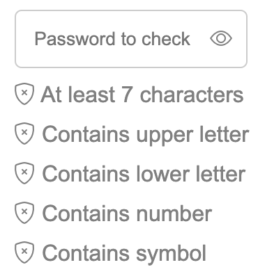
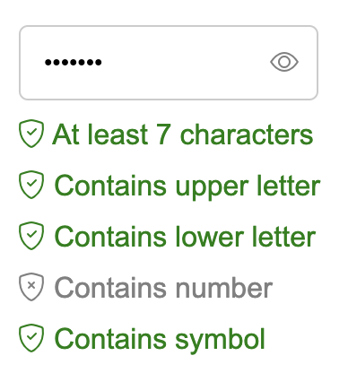
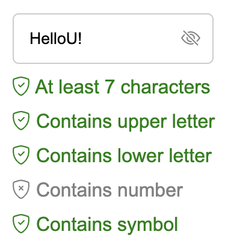

# Passsword checker
## Functionality
Password input field checks the following:
- length of the input (currently set to minimum of 7 characters)
- presence of at least 1 upper case character
- presence of at least 1 lower case character
- presence of at least 1 number
- presence of at least 1 special symbol

## Additional features:
- once any of the conditions is met, icon changes to tick mark inside the shield and condition text changes color from gray to green

- by clicking the eye icon, visibility of input changes from password to text

